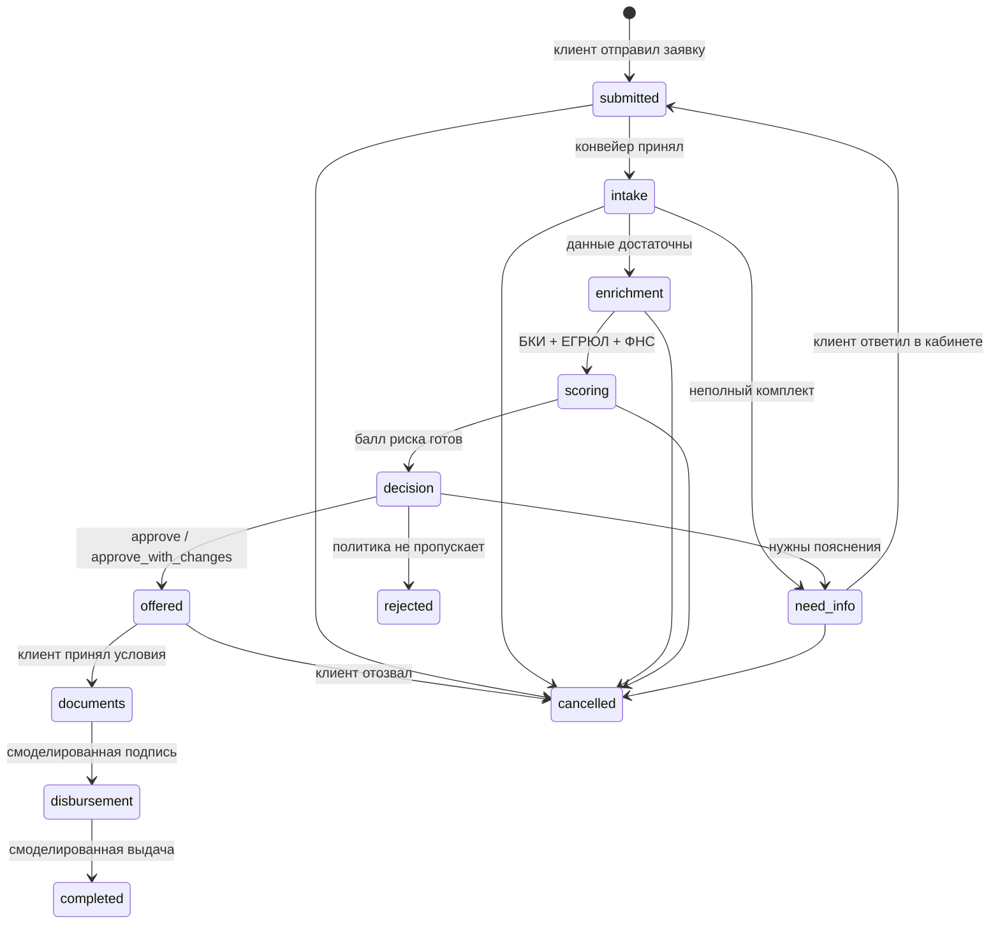

# Диаграмма состояний заявки

```mermaid
stateDiagram-v2
    [*] --> submitted: клиент отправил заявку
    submitted --> intake: конвейер принял
    intake --> need_info: неполный комплект
    intake --> enrichment: данные достаточны
    enrichment --> scoring: БКИ + ЕГРЮЛ + ФНС
    scoring --> decision: балл риска готов
    decision --> offered: approve / approve_with_changes
    decision --> need_info: нужны пояснения
    decision --> rejected: политика не пропускает
    need_info --> submitted: клиент ответил в кабинете
    offered --> documents: клиент принял условия
    offered --> cancelled: клиент отозвал
    documents --> disbursement: смоделированная подпись
    disbursement --> completed: смоделированная выдача
    submitted --> cancelled
    intake --> cancelled
    enrichment --> cancelled
    scoring --> cancelled
    need_info --> cancelled
```